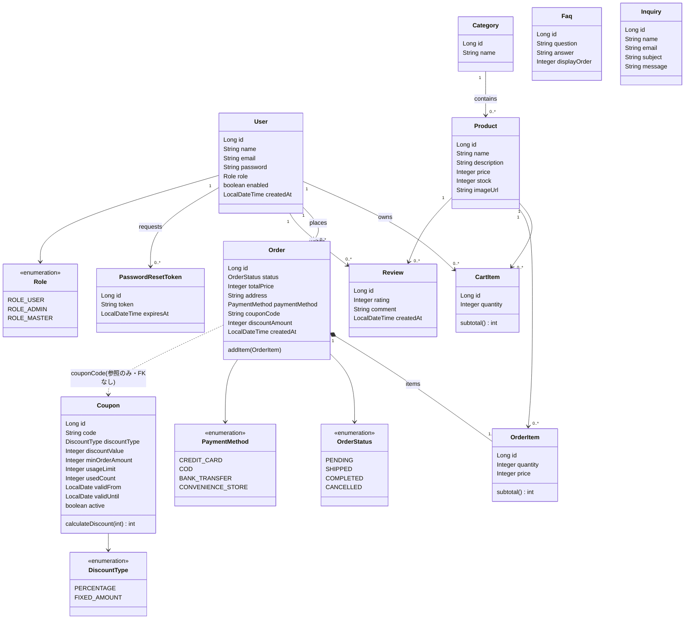
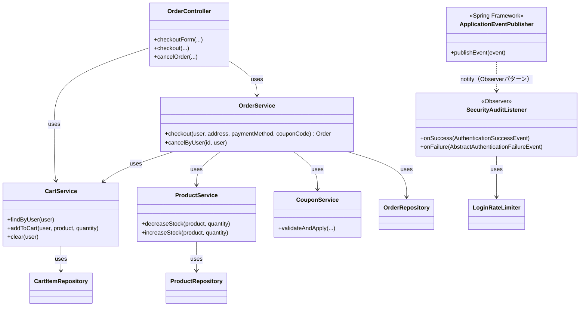
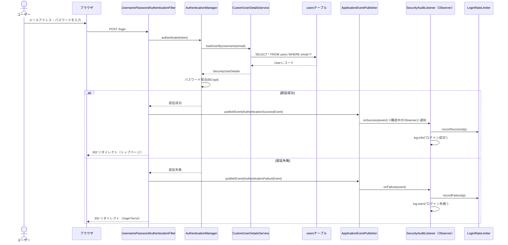
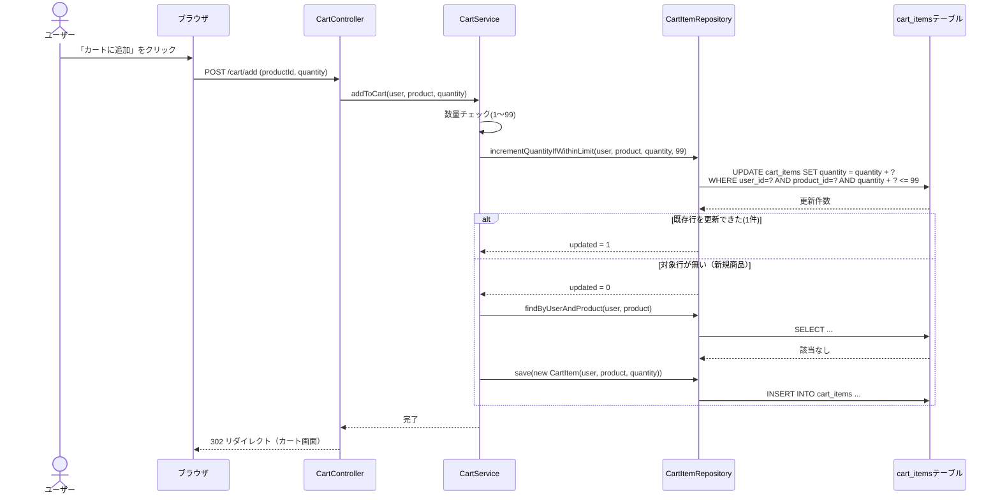
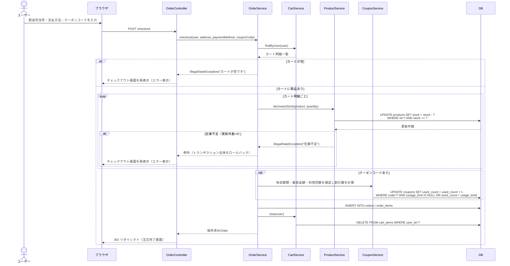

# ECサイト 設計書

## 1. 概要

| 項目 | 内容 |
|---|---|
| システム名 | シンプルECサイト（Simple-EC） |
| 目的 | Java（Spring Boot）を用いた標準機能のECサイトを構築する |
| 対象規模 | 標準ECサイト（会員機能・カート・注文・管理者機能を含む） |

## 2. 技術スタック

| 分類 | 採用技術 | 備考 |
|---|---|---|
| 言語 | Java 17 | |
| フレームワーク | Spring Boot 3.3.x | Web / Data JPA / Security / Validation / Thymeleaf |
| ビルドツール | Maven | pom.xml で依存管理 |
| テンプレートエンジン | Thymeleaf | サーバーサイドレンダリング |
| フロントエンド | 素のHTML / CSS / JavaScript | フレームワークなし（Thymeleafテンプレート内に記述） |
| DB | SQLite | ファイルベース。`sqlite-jdbc` + `hibernate-community-dialects` を使用 |
| ORM | Spring Data JPA (Hibernate) | |
| 認証 | Spring Security（フォームログイン、BCryptパスワードハッシュ） | |
| その他 | Bean Validation（入力チェック） | |

## 3. 機能一覧

### 3.1 一般ユーザー向け機能

| No | 機能 | 概要 |
|---|---|---|
| 1 | 会員登録 | 氏名・メール・パスワードで新規登録 |
| 2 | ログイン／ログアウト | Spring Securityによるフォーム認証。「ログイン状態を保持する」チェックでRemember-Me Cookieを発行（有効期間1週間） |
| 3 | パスワード再設定 | メールアドレス入力→再設定用トークン発行（30分間有効・使い切り）。メール送信基盤がないため、再設定リンクは画面上に直接表示する簡易実装 |
| 4 | 商品一覧表示 | カテゴリ絞り込み、ページング |
| 5 | 商品検索・絞り込み | キーワード検索（商品名・説明、全角/半角・ひらがな/カタカナの表記ゆれと同義語辞書に対応）、価格帯絞り込み（実際の商品価格帯から動的にレンジを算出するデュアルハンドルスライダー）、並び替え（新着順／価格昇順／価格降順／評価順） |
| 6 | 商品詳細表示 | 商品画像・説明・価格・在庫・平均評価・レビュー一覧を表示 |
| 7 | レビュー・評価 | ログインユーザーが商品に星評価（1〜5）とコメントを投稿。1商品につき1ユーザー1件（再投稿で更新） |
| 8 | カート機能 | 商品をカートに追加／数量変更／削除（DB保存）。同一商品への同時追加リクエストによる数量の取りこぼし（lost update）を防ぐため、既存行への加算は原子的なUPDATEで行う |
| 9 | 注文（チェックアウト） | 配送先住所・支払い方法（クレジットカード／代引き／銀行振込／コンビニ払い、いずれも実際の決済処理は行わないデモ）を入力→注文確定→在庫減算（在庫が足りない場合は原子的なUPDATEで検知し失敗させる）。郵便番号を入力して「住所を検索」を押すと、外部の郵便番号検索API（zipcloud）から取得した住所を自動入力できる（PostalCodeService） |
| 10 | クーポン適用 | チェックアウト時にクーポンコードを入力すると、有効期間・最低注文金額・利用回数上限を満たす場合に注文合計金額から割引（率指定または固定額）。1ユーザーにつき同一クーポンは1回まで利用可 |
| 11 | 注文履歴閲覧 | ログインユーザーが自分の注文一覧・詳細を確認 |
| 12 | 注文キャンセル | 発送前（注文受付中）の自分の注文のみキャンセル可能。キャンセル時に在庫を自動的に復元 |
| 13 | マイページ | 会員情報（氏名・メールアドレス）の確認、氏名変更、パスワード変更 |
| 14 | ハンバーガーメニュー | 画面幅によらず常時表示される左スライドインメニュー。カテゴリ一覧・ショップメニュー・アカウント情報への導線をまとめて表示 |
| 15 | FAQ閲覧 | よくある質問と回答の一覧を表示（ログイン不要） |
| 16 | 問い合わせ | 氏名・メールアドレス・件名・本文を送信するお問い合わせフォーム（ログイン不要）。メール送信基盤が無いためDBに保存し、管理者が管理画面で確認する |

### 3.2 管理者向け機能

| No | 機能 | 概要 |
|---|---|---|
| 1 | 管理者ログイン | ROLE_ADMIN（またはROLE_MASTER）によるアクセス制御 |
| 2 | ダッシュボード | 売上合計（キャンセル除く）、注文ステータス内訳、直近の注文、在庫僅少商品（在庫5以下）、商品数・カテゴリ数・会員数を一覧表示 |
| 3 | 商品管理（CRUD） | 商品の登録・編集・削除・一覧 |
| 4 | カテゴリ管理（CRUD） | カテゴリの登録・編集・削除 |
| 5 | 注文管理 | 全注文の一覧・ステータス変更（注文受付／発送済／完了）・注文キャンセル（完了・キャンセル済み以外はいつでも可能、在庫を自動復元） |
| 6 | クーポン管理（CRUD） | クーポンコード・割引方式（率／固定額）・最低注文金額・有効期間・利用回数上限の登録・編集・削除・有効/無効切り替え |
| 7 | FAQ管理（CRUD） | よくある質問の登録・編集・削除・表示順の設定 |
| 8 | 問い合わせ管理 | 問い合わせの一覧・詳細確認・削除 |
| 9 | 会員管理（ROLE_MASTER専用） | 会員のロール変更、アカウントの有効/無効化。マスター管理者は自分自身のロール変更・無効化はできない（誤操作によるロックアウト防止） |

### 3.3 権限ロール

| ロール | 説明 |
|---|---|
| `ROLE_USER` | 一般ユーザー。会員登録・カート・注文・レビュー・問い合わせ等を利用できる |
| `ROLE_ADMIN` | 管理者。商品・カテゴリ・注文・クーポン・FAQ・問い合わせの管理ができる |
| `ROLE_MASTER` | マスター管理者。ROLE_ADMINの操作に加えて会員管理（ロール変更・アカウント有効/無効化）ができる最上位ロール。`SecurityUserDetails`側でROLE_ADMINの権限もあわせて付与されるため、管理画面（`/admin/**`）へもそのままアクセスできる |

### 3.4 対象外（フル機能スコープ）

決済ゲートウェイ連携（クレジットカード決済等の実際の課金処理）、実際のメール送信（SMTP連携）、全文検索エンジン連携（Elasticsearch等）は対象外とする（拡張ポイントとして設計上は考慮）。パスワード再設定は本来メール送信すべき箇所を画面表示に代替した簡易実装。クーポン機能は実装済みだが、決済ゲートウェイとの連携は行わない。

## 4. 画面遷移図

```
[トップ/商品一覧] --詳細--> [商品詳細] --カート追加--> [カート]
     |                                                  |
   ログイン ---パスワードを忘れた場合--> [再設定リンク発行] -> [新パスワード入力]
     |
   新規登録                                            チェックアウト
     |                                                  |
   [マイページ] --氏名/パスワード変更--> [会員情報編集/パスワード変更]
     |
     --注文履歴--> [注文履歴一覧] --詳細--> [注文詳細] --(受付中のみ)キャンセル

[チェックアウト] -確定完了-> [注文確認/確定]

管理者:
[管理ログイン] -> [ダッシュボード] -> [商品一覧管理] -> [商品登録/編集]
                                 -> [カテゴリ管理]
                                 -> [注文管理] -> [注文詳細/ステータス変更・キャンセル]
```

## 5. DB設計（ER概要）

- **users** (id, name, email[unique], password, role, created_at)
- **categories** (id, name)
- **products** (id, name, description, price, stock, image_url, category_id → categories.id)
- **cart_items** (id, user_id → users.id, product_id → products.id, quantity)
- **orders** (id, user_id → users.id, status, total_price, address, payment_method, coupon_code, discount_amount, created_at)
- **order_items** (id, order_id → orders.id, product_id → products.id, quantity, price)
- **reviews** (id, product_id → products.id, user_id → users.id, rating, comment, created_at)
- **password_reset_tokens** (id, user_id → users.id, token[unique], expires_at)
- **coupons** (id, code[unique], discount_type, discount_value, min_order_amount, usage_limit, used_count, valid_from, valid_until, active, created_at)
- **faqs** (id, question, answer, display_order)
- **inquiries** (id, name, email, subject, message, created_at)

### 5.1 テーブル定義

**users**
| カラム | 型 | 制約 |
|---|---|---|
| id | INTEGER | PK, AUTO INCREMENT |
| name | VARCHAR(100) | NOT NULL |
| email | VARCHAR(255) | NOT NULL, UNIQUE |
| password | VARCHAR(255) | NOT NULL（BCryptハッシュ） |
| role | VARCHAR(20) | NOT NULL（ROLE_USER / ROLE_ADMIN / ROLE_MASTER） |
| enabled | BOOLEAN | NOT NULL, DEFAULT true（マスター管理者による無効化フラグ。falseならログイン不可） |
| created_at | TIMESTAMP | NOT NULL |

**categories**
| カラム | 型 | 制約 |
|---|---|---|
| id | INTEGER | PK, AUTO INCREMENT |
| name | VARCHAR(100) | NOT NULL |

**products**
| カラム | 型 | 制約 |
|---|---|---|
| id | INTEGER | PK, AUTO INCREMENT |
| name | VARCHAR(200) | NOT NULL |
| description | TEXT | |
| price | INTEGER | NOT NULL（円単位） |
| stock | INTEGER | NOT NULL, DEFAULT 0 |
| image_url | VARCHAR(500) | |
| category_id | INTEGER | FK -> categories.id |

**cart_items**
| カラム | 型 | 制約 |
|---|---|---|
| id | INTEGER | PK, AUTO INCREMENT |
| user_id | INTEGER | FK -> users.id |
| product_id | INTEGER | FK -> products.id |
| quantity | INTEGER | NOT NULL |

制約: (user_id, product_id) の組み合わせで一意（同一ユーザー・同一商品のカート明細は1行のみ）。同一商品への同時「カートに追加」による競合の最終防波堤。既存行への数量加算自体は、この制約とは別に原子的なUPDATE（`quantity + :delta <= 上限`をWHERE句に含む）で行い、更新の取りこぼしを防ぐ。

**orders**
| カラム | 型 | 制約 |
|---|---|---|
| id | INTEGER | PK, AUTO INCREMENT |
| user_id | INTEGER | FK -> users.id |
| status | VARCHAR(20) | NOT NULL（PENDING / SHIPPED / COMPLETED / CANCELLED） |
| total_price | INTEGER | NOT NULL（割引後の金額） |
| address | VARCHAR(500) | NOT NULL |
| payment_method | VARCHAR(30) | NOT NULL, DEFAULT 'COD'（CREDIT_CARD / COD / BANK_TRANSFER / CONVENIENCE_STORE。実際の決済処理は行わない） |
| coupon_code | VARCHAR(30) | 適用したクーポンのコード（未使用ならNULL） |
| discount_amount | INTEGER | NOT NULL, DEFAULT 0（クーポンによる割引額） |
| created_at | TIMESTAMP | NOT NULL |

> CANCELLEDは注文キャンセル機能の追加時に導入。SQLiteのCHECK制約は`ddl-auto=update`では自動更新されないため、既存DBに対しては手動でのスキーマ移行（テーブル再作成＋データ移行）が必要だった。
>
> 制約: (user_id, coupon_code) の組み合わせで一意（同一ユーザーが同じクーポンで複数注文を持てない＝1人1クーポン1回まで）。couponCodeがNULLの注文同士はSQL上NULLが互いに等しいとみなされないため抵触しない。

**order_items**
| カラム | 型 | 制約 |
|---|---|---|
| id | INTEGER | PK, AUTO INCREMENT |
| order_id | INTEGER | FK -> orders.id |
| product_id | INTEGER | FK -> products.id |
| quantity | INTEGER | NOT NULL |
| price | INTEGER | NOT NULL（注文時点の単価） |

**reviews**
| カラム | 型 | 制約 |
|---|---|---|
| id | INTEGER | PK, AUTO INCREMENT |
| product_id | INTEGER | FK -> products.id |
| user_id | INTEGER | FK -> users.id |
| rating | INTEGER | NOT NULL（1〜5） |
| comment | TEXT | |
| created_at | TIMESTAMP | NOT NULL |

制約: (product_id, user_id) の組み合わせで一意（1ユーザー1商品につき1レビュー、再投稿は上書き更新）。

**password_reset_tokens**
| カラム | 型 | 制約 |
|---|---|---|
| id | INTEGER | PK, AUTO INCREMENT |
| user_id | INTEGER | FK -> users.id |
| token | VARCHAR(100) | NOT NULL, UNIQUE（UUID文字列） |
| expires_at | TIMESTAMP | NOT NULL（発行から30分後） |

トークンは使用後（パスワード再設定成功時）または有効期限切れの検証時に削除される（使い切り）。同一ユーザーが再度発行すると古いトークンは削除され、常に最大1件だけ有効な状態になる。

**coupons**
| カラム | 型 | 制約 |
|---|---|---|
| id | INTEGER | PK, AUTO INCREMENT |
| code | VARCHAR(30) | NOT NULL, UNIQUE（注文時に入力するクーポンコード） |
| discount_type | VARCHAR(20) | NOT NULL（PERCENTAGE / FIXED_AMOUNT） |
| discount_value | INTEGER | NOT NULL（率(1-100)または固定額(円)。discount_typeに応じて解釈が変わる） |
| min_order_amount | INTEGER | NOT NULL, DEFAULT 0（適用可能な最低注文金額。0なら制限なし） |
| usage_limit | INTEGER | 総利用可能回数の上限（NULLなら無制限） |
| used_count | INTEGER | NOT NULL, DEFAULT 0（これまでの利用回数） |
| valid_from | DATE | 有効期間の開始日（NULLなら制限なし） |
| valid_until | DATE | 有効期間の終了日（NULLなら制限なし） |
| active | BOOLEAN | NOT NULL, DEFAULT true（falseで即座に利用不可にできる） |
| created_at | TIMESTAMP | NOT NULL |

利用回数の上限チェック＋加算は、在庫の原子的な増減と同じ考え方で1本のUPDATE文（`usage_limit IS NULL OR used_count < usage_limit`をWHERE句に含む）により行い、複数注文が同時に上限を使い切る競合を防ぐ。

**faqs**
| カラム | 型 | 制約 |
|---|---|---|
| id | INTEGER | PK, AUTO INCREMENT |
| question | VARCHAR(200) | NOT NULL |
| answer | TEXT | NOT NULL |
| display_order | INTEGER | NOT NULL, DEFAULT 0（値が小さいものほど先に表示） |

**inquiries**
| カラム | 型 | 制約 |
|---|---|---|
| id | INTEGER | PK, AUTO INCREMENT |
| name | VARCHAR(100) | NOT NULL |
| email | VARCHAR(200) | NOT NULL |
| subject | VARCHAR(200) | NOT NULL |
| message | TEXT | NOT NULL |
| created_at | TIMESTAMP | NOT NULL |

メール送信基盤を持たないため、問い合わせ内容はこのテーブルに保存し、管理者が管理画面（`/admin/inquiries`）で確認する運用。

## 6. パッケージ構成

```
com.example.ec
 ├─ EcApplication.java（@EnableCaching, @EnableScheduling）
 ├─ config/          SecurityConfig（認証・認可・Remember-Me・CSRF・CSP）, DataInitializer（初期データ投入）,
 │                     CustomUserDetailsService, SecurityUserDetails,
 │                     GlobalModelAdvice（全画面共通でカテゴリ一覧をモデルに注入。findAllはキャッシュ済み）,
 │                     LoginRateLimiter（ログイン・会員登録・パスワード再設定申請のレート制限カウンター）,
 │                     LoginRateLimitFilter, SecurityAuditListener（ログイン成否の監査ログ）,
 │                     RestTemplateConfig（外部API呼び出し用RestTemplateのBean定義。タイムアウトを短めに設定）
 ├─ entity/          User, Role, Category, Product, CartItem, Order, OrderItem, OrderStatus,
 │                     PaymentMethod, Review, PasswordResetToken, Coupon, DiscountType, Faq, Inquiry
 ├─ repository/      各Repositoryインターフェース（ProductRepositoryはJpaSpecificationExecutorを実装、
 │                     在庫増減・カート数量加算・クーポン利用回数加算の原子的UPDATEクエリを定義。
 │                     @EntityGraphでカテゴリ・カート商品・注文明細/注文者を一括取得）
 ├─ specification/   ProductSpecifications（検索・絞り込み条件の組み立て）
 ├─ util/            TextNormalizer（全角/半角・ひらがな/カタカナの正規化）
 ├─ constant/        SearchSynonyms（商品検索用の同義語辞書）
 ├─ service/         UserService, ProductService, CartService, OrderService, CategoryService,
 │                     ReviewService, PasswordResetService, CouponService, FaqService, InquiryService,
 │                     PostalCodeService（郵便番号検索API(zipcloud)をRestTemplateで呼び出し、住所を取得）
 ├─ controller/       HomeController, ProductController, CartController, OrderController,
 │                     AuthController, MypageController, FaqController, ContactController
 ├─ controller/admin/ AdminDashboardController, AdminProductController, AdminCategoryController,
 │                     AdminOrderController, AdminCouponController, AdminFaqController,
 │                     AdminInquiryController, AdminUserController（ROLE_MASTER専用）,
 │                     AdminControllerSupport（削除処理の共通エラーハンドリング）
 └─ dto/             RegisterForm, CheckoutForm, ProductForm, ReviewForm, ProfileForm,
                       ChangePasswordForm, ForgotPasswordForm, ResetPasswordForm, CouponForm,
                       FaqForm, ContactForm, ProductSort, SalesPoint 等
```

## 7. 画面一覧（Thymeleafテンプレート）

| テンプレート | パス | 内容 |
|---|---|---|
| fragments/layout.html | - | 共通レイアウト（ヘッダー／フッター、ハンバーガーメニュー用の左スライドインドロワーを含む） |
| fragments/admin_nav.html | - | 管理画面共通ナビゲーション |
| index.html | / | 商品一覧トップ（キーワード検索・価格帯デュアルスライダー・カテゴリ絞り込み・並び替え対応） |
| product/detail.html | /products/{id} | 商品詳細（平均評価・レビュー一覧・投稿フォーム） |
| cart/cart.html | /cart | カート内容 |
| order/checkout.html | /checkout | 注文入力 |
| order/complete.html | /checkout/complete/{id} | 注文完了 |
| order/history.html | /mypage/orders | 注文履歴一覧 |
| order/detail.html | /mypage/orders/{id} | 注文詳細（受付中の注文はキャンセルボタンを表示） |
| auth/login.html | /login | ログイン（Remember-Meチェックボックス、パスワードをお忘れの方リンク） |
| auth/register.html | /register | 新規登録 |
| auth/forgot_password.html | /forgot-password | パスワード再設定リンクの発行 |
| auth/reset_password.html | /reset-password | 新しいパスワードの入力 |
| mypage/index.html | /mypage | マイページ（会員情報表示、各種メニューへの導線） |
| mypage/edit.html | /mypage/edit | 氏名変更 |
| mypage/password.html | /mypage/password | パスワード変更 |
| admin/dashboard.html | /admin | 管理者ダッシュボード |
| admin/products.html | /admin/products | 商品管理一覧 |
| admin/product_form.html | /admin/products/new, /admin/products/{id}/edit | 商品登録・編集 |
| admin/categories.html | /admin/categories | カテゴリ管理 |
| admin/orders.html | /admin/orders | 注文管理一覧 |
| admin/order_detail.html | /admin/orders/{id} | 注文詳細・ステータス変更・キャンセル |
| admin/coupons.html | /admin/coupons | クーポン管理一覧 |
| admin/coupon_form.html | /admin/coupons/new, /admin/coupons/{id}/edit | クーポン登録・編集 |
| admin/faqs.html | /admin/faqs | FAQ管理一覧 |
| admin/faq_form.html | /admin/faqs/new, /admin/faqs/{id}/edit | FAQ登録・編集 |
| admin/inquiries.html | /admin/inquiries | 問い合わせ管理一覧 |
| admin/inquiry_detail.html | /admin/inquiries/{id} | 問い合わせ詳細 |
| admin/users.html | /admin/users | 会員管理（ROLE_MASTER専用。ロール変更・有効/無効化） |
| faq.html | /faq | FAQ一覧（公開ページ） |
| contact.html | /contact | 問い合わせフォーム |

静的リソース: `/static/css/style.css`, `/static/js/cart.js`, `/static/js/menu.js`（ハンバーガーメニュー開閉）, `/static/js/price-range.js`（価格帯スライダー）, `/static/js/postal-code.js`（郵便番号からの住所自動入力）

## 7.1 外部API連携（郵便番号検索）

チェックアウト画面で郵便番号から住所を自動入力できるようにするため、日本郵便の郵便番号データを提供する無料API「[zipcloud](https://zipcloud.ibsnet.co.jp/)」を利用している（登録・APIキー不要）。

- **フロー**: ブラウザ（`postal-code.js`）→ 自サーバー `GET /checkout/postal-code/{zipcode}`（`OrderController#postalCode`）→ `PostalCodeService` が `RestTemplate` で zipcloud APIを呼び出し → 結果をJSONでブラウザに返す
- ブラウザから外部APIへ直接アクセスさせず、必ずサーバー経由（プロキシ）にしている。これによりCSPの`connect-src`を外部ドメイン向けに緩める必要がなく、外部APIのURL自体もクライアントに露出しない
- `RestTemplateConfig`で接続・読み取りとも3秒のタイムアウトを設定し、外部APIが応答しない場合でもリクエストスレッドが長時間ブロックされないようにしている
- zipcloud APIはJSONを返すにもかかわらず`Content-Type: text/plain`を付与してくる。`RestTemplate`にレスポンス型を直接指定すると対応する`HttpMessageConverter`が見つからず失敗する（`UnknownContentTypeException`）ため、いったん文字列として受け取ってから`ObjectMapper`で手動パースしている
- 郵便番号の形式不正・該当住所なし・外部APIの呼び出し失敗（タイムアウト等）は、いずれもユーザーへは「住所を直接入力してください」という穏当なメッセージに変換して返し、詳細な例外はサーバーログにのみ記録する

## 8. セキュリティ設計

- `/`, `/products/**`（GET）, `/css/**`, `/js/**`, `/img/**`, `/register`, `/login`, `/error`, `/forgot-password`, `/reset-password`, `/faq`, `/contact` は未認証で許可
- `/products/{id}/reviews`（POST）はレビュー投稿のため認証必須
- `/mypage/**`, `/cart/**`, `/checkout/**` は ROLE_USER 以上（認証必須）
- `/admin/users/**` は ROLE_MASTER のみ（`/admin/**`より前に評価されるルール）
- `/admin/**`（`/admin/users/**`を除く）は ROLE_ADMIN 以上（ROLE_MASTERはROLE_ADMIN権限もあわせて持つためアクセス可）
- パスワードは BCryptPasswordEncoder でハッシュ化して保存
- CSRF保護は Spring Security デフォルト有効（フォームにトークン埋め込み）
- Content-Security-Policy: `default-src 'self'; img-src 'self' data: https:; object-src 'none'; frame-ancestors 'none'`。商品画像は管理者が外部URLを設定できる仕様のため、img-srcのみhttps:を許可している
- ログインのレート制限（ブルートフォース対策）: 同一IPから15分間に5回ログイン失敗すると以降のログイン試行を429で拒否（`LoginRateLimiter`/`LoginRateLimitFilter`）。会員登録・パスワード再設定申請も同様に、同一IPからの送信回数（成否を問わない）を15分間5回までに制限する
- Remember-Me（ログイン状態の保持）: `tokenValiditySeconds`を1週間に設定。トークン生成キーは`application.properties`の`app.remember-me.key`から読み込み、アプリ再起動をまたいでもCookieが無効化されないようにしている（未設定だと起動ごとにランダムキーが生成され、再起動で全ユーザーがログアウトされてしまう）
- パスワード再設定トークンは30分間有効・使い切り（検証時に期限切れなら即削除、再設定成功時にも削除）
- マスター管理者による会員管理（ロール変更・無効化）は、自分自身を対象にした操作をサービス層で拒否し、誤操作によるロックアウトを防止する
- 注文・注文詳細・マイページ関連は、対象レコードの`user_id`が本人のものかをコントローラー／サービス層で都度チェックし、他人のデータへのアクセスを防止

## 9. 初期データ

- 管理者アカウント（デモ用）: `admin@example.com` / `admin123`（ROLE_ADMIN）
- テスト用マスター管理者アカウント: `master@example.com` / `master1234`（ROLE_MASTER）
- サイト運営者アカウント（マスター管理者）: `owner@example.com`（ROLE_MASTER、パスワードは環境変数`MASTER_PASSWORD`/DataInitializer参照）
- 一般テストアカウント: `user@example.com` / `user1234`（ROLE_USER）
- カテゴリ・商品のサンプルデータを起動時に投入（DataInitializer）: 書籍／家電／キッチン用品の3カテゴリ、計6商品
- FAQのサンプルデータを起動時に投入（DataInitializer）: 6件

## 10. 開発・ビルド時の注意

- ビルド時のJDKは **JDK 23** を使用すること。JDK 24ではLombokとの組み合わせでコンパイルエラー（`ExceptionInInitializerError: com.sun.tools.javac.code.TypeTag :: UNKNOWN`）が発生することを確認済み。詳細は [README.md](../README.md) を参照。
- サービス層のユニットテスト（Mockitoでリポジトリ層をモックし、実DBには依存しない）: `OrderServiceTest`（注文作成・キャンセル・在庫増減・クーポン適用）、`ProductServiceTest`、`CartServiceTest`（カート数量加算の原子的UPDATE経路）、`CategoryServiceTest`、`CouponServiceTest`、`UserServiceTest`（会員ロール変更・有効化の自己保護ロジック）、`ReviewServiceTest`、`PasswordResetServiceTest`、`FaqServiceTest`、`InquiryServiceTest`
- コントローラーテスト（`@WebMvcTest`）: `AuthControllerTest`、`MypageControllerTest`、`AdminUserControllerTest`（会員管理の自己保護ロジックがコントローラー層で正しくエラー表示されるか）
- `spring.jpa.open-in-view=false`のため、テンプレート側で参照する遅延ロード項目（商品カテゴリ・カート内商品・注文明細/注文者）は各Repositoryの`@EntityGraph`で明示的に一括取得している。新しくLAZY関連をテンプレートやコントローラーで参照する場合は、対応するRepositoryメソッドに`@EntityGraph`を追加すること（忘れると`LazyInitializationException`になる）。

## 11. 設計図（クラス図・シーケンス図）

GitHub上ではそのまま図として描画される（Mermaid記法）。

### 11.1 クラス図（ドメインモデル／エンティティ）

5節のER概要をクラス図として表現したもの。`Order`と`Coupon`はDB上の外部キーではなく`couponCode`（文字列）で緩く紐づいている点に注意（4.節の「1ユーザー1クーポン1回まで」制約はDBのユニーク制約`uk_orders_user_coupon`で担保）。



### 11.2 クラス図（レイヤー構成／注文まわり）

Controller → Service → Repositoryの層構造（MVCのうちM/Cにあたる部分）に加え、8.節で触れた監査ログの仕組み（`SecurityAuditListener`）がSpringのイベント機構（`ApplicationEventPublisher`）を介したObserverパターンの実装であることを示す。



### 11.3 シーケンス図

#### 11.3.1 ログイン（Observerパターンによる監査ログ記録）

Spring Securityが認証成功/失敗のたびに発行するイベントを`SecurityAuditListener`が購読（Observer）し、フィルターチェーン本体には手を入れずに監査ログとレート制限を実現している（8.節参照）。



#### 11.3.2 カートに追加（同時リクエストでも数量を失わない原子的UPDATE）

「読み取り→加算→書き込み」ではなく1本のUPDATE文で加算することで、同一商品への同時追加リクエストによるlost updateを防いでいる（3.1節・5.1節参照）。



#### 11.3.3 注文確定（チェックアウト：在庫の原子的減算とクーポン適用）

在庫チェック＋減算を1本のUPDATE文（`WHERE stock >= ?`）で行うことで、複数ユーザーの同時注文でも在庫がマイナスにならないようにしている（3.1節・アピールポイント参照）。`@Transactional`のため、途中で在庫不足の例外が発生すればそれまでの在庫減算もロールバックされる。


